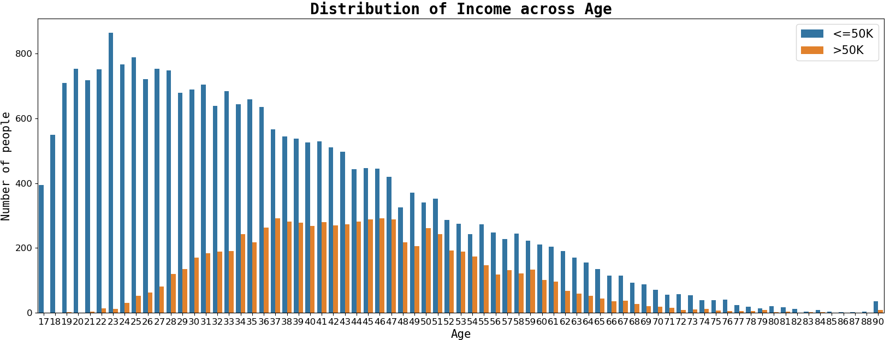

# CENSUS-INCOME-PREDICTIONS:-
Census Income Includes A Detailed Eda To Find Actionable Insights And Further Dwells Deeper Into Predictive Analytics Using Classification  Machine Learning Algorithms Such As Logistic Regression, Knn Classifier, Support Vector Classifier, Decision Tree Classifier, Random Forest Classifier And Xgboost Etc.

## OVERVIEW:-
- In This Notebook, We Are Going To Predict Whether A Person's Income Is Above 50k Or Below 50k Using Various Features Like Age, Education, And Occupation.

- 
  

## DATASET:-

| Column ID |   Column Name  | Data type | Values type |          Description         |
|:---------:|:--------------:|:---------:|:-----------:|:----------------------------:|
|     0     |       age      |   int64   |  Continous  |         Age of person        |
|     1     |    workclass   |   object  |   Discrete  |      Workclass of person     |
|     2     |     fnlwgt     |   int64   |  Continous  |         Final weight         |
|     3     |    education   |   object  |   Discrete  |  Education Degree of person  |
|     4     |  education.num |   int64   |  Continous  | Number of years of education |
|     5     | marital.status |   object  |   Discrete  |   Marital status of person   |
|     6     |   occupation   |   object  |   Discrete  |     Occupation of person     |
|     7     |  relationship  |   object  |   Discrete  |    Relationship of person    |
|     8     |      race      |   object  |   Discrete  |        Race of person        |
|     9     |       sex      |   object  |   Discrete  |         Sex of person        |
|     10    |  capital.gain  |   int64   |  Continous  |    Capital gain of person    |
|     11    |  capital.loss  |   int64   |  Continous  |    Capital loss of person    |
|     12    | hours.per.week |   int64   |  Continous  |   Number of hours per week   |
|     13    | native.country |   object  |   Discrete  |   Native country of person   |
|     14    |     income     |   object  |   Discrete  |   Income category of person  |

----

- 

- ## MOTIVATION:-
- Building Such Predictive Models Can Help Us Better Understand The Population Of A Country As Well As The Various Factors Affecting The Growth In The Economy.
- Governments Can Understand Such Factors And Improve Upon Them Leading To The Growth Of The Country.

## CONCLUSION:-
- In This Project We Build Various Models Like Logistic Regression, KNN Classifier, Support Vector Classifier, Decision Tree Classifier, Random Forest Classifier And Xgboost Calssifier.
- A Hyperparameter Tuned Random Forest Classifier Gives The Highest Accuracy Score Of 91.01 And F1 Score Of 91.48

## FUTURE WORK:-
- We Have A Large Enough DATASET, So We Can Use Neural Networks Such As An Artificial Neural Network To Build A Model Which Can Result In Better Performance.

